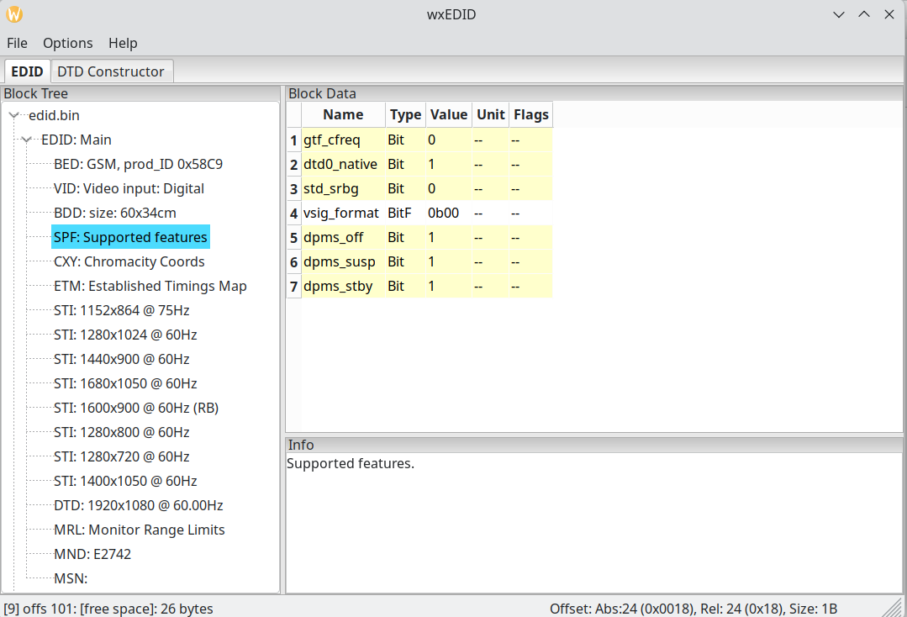
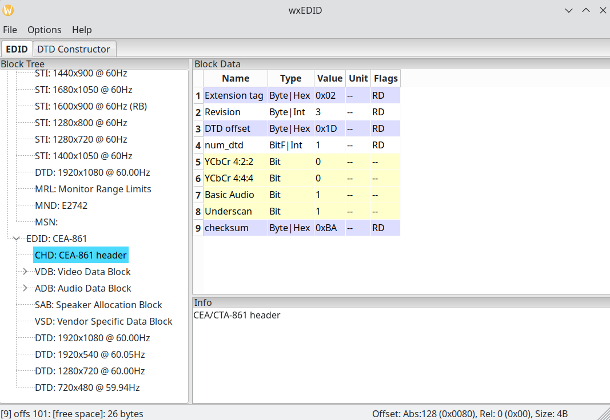

# Custom EDID on Linux for AMD/ Intel GPUs

## Introduction

### What is EDID

EDID is the visual display unit (VDU) spec file. It contains all features of the monitor or TV, like color range, resolution and refresh rate, HDMI interface standard, vendor details, etc. EDID is generated as a file on Linux during the first handshake, i.e. when the monitor is first seen by the kernel.

### The problem

**AMD** and **Intel** use full range of colors for every monitor or TV, whether new or old, when using HDMI or DisplayPort and if the EDID mentions YCbCr support. Many old monitors don't support the full range, in which case their colors or brightness/ gamma under AMD/ Intel GPUs (both dedicated or integrated) are either washed out (fuzzy upper limit) or blackened (fuzzy lower limit). For example, in 8 bit color, the full range **0-255** of colors are not available; only a limited range like **16-235**, making the colors appear inaccurate.

This is not a problem for **NVIDIA** GPUs; they are smart enough to determine what the monitor is capable of, and set the range accordingly. So the same monitor, when connected to one, will show proper colors. 

This is not a problem if **VGA** or **DVI** ports are used, but most modern GPUs don't have these legacy ports. Also, modern TVs almost always use HDMI as the display interface even for PC mode. So if someone doesn't want to go through the trouble of following this guide, they can also use a **HDMItoVGA** or **HDMItoDVI** adapter (similarly for DisplayPort) to circumvent the issue.

This is also not a problem on **Windows**, since both **AMD Adrenalin** or **Intel Graphics Control Panel** can set the range through their UI if the OS handshake fails to recognize the right range. On the other side, **NVIDIA Control Panel** can be used to change color range, though it is not often required if they do it right by default.

### The workaround - spoof EDID 

The EDID file is created by initial handshake, when the computer starts and kernel sees the monitor. It can also be created when another monitor is hot-swapped. 

We want to spoof this EDID to the kernel so that instead of default values it takes the modified version. Then the VDU will be recognized for what it is and the colors will show up proper.

## Steps on Arch Linux

The below is a very specific, custom EDID workaround for monitors who have YCbCr support but AMD or Intel GPUs are not able to use it properly, resulting in either washed out colors or dark colors (Black Crush), i.e. either the white point is fuzzy or the black point. 

The guide assumes **Arch Linux** or its variants like **EndeavourOS** or **CachyOS**. Similar steps will also work in other Linux distributions like Mint or Ubuntu, but the last steps might differ.

If at **step 6** you don't see the results, then there is some other issue with your setup, and cannot be fixed by this guide. You can stop there and it won't make any permanent change to your system at that point.

The below guide can also be referred for using a custom EDID for any other purpose. For example, the GPU may not recognize all refresh rate or resolution modes, which can be fixed by a custom EDID. However, you should use only the EDID of your device as the source.


### 1. Find monitor device id, and source edid from /sys/class/drm

```
$ ls /sys/class/drm/card*
/sys/class/drm/card1:
boot_display  card1-DP-1  card1-HDMI-A-1  card1-Writeback-1  dev  device  power  subsystem  uevent

/sys/class/drm/card1-DP-1:
connector_id  ddc  device  dpms  drm_dp_aux0  edid  enabled  i2c-4  modes  power  status  subsystem  uevent

/sys/class/drm/card1-HDMI-A-1:
connector_id  ddc  device  dpms  edid  enabled  modes  power  status  subsystem  uevent

/sys/class/drm/card1-Writeback-1:
connector_id  device  dpms  edid  enabled  modes  power  status  subsystem  uevent
```

If the monitor is connected to HDMI port, we want ```card1-HDMI-A-1/edid```. Note that edid is a bin file, even if it does not have the extension.

We can check which card is being used by either
1. grep dmesg (as sudo)
2. kscreen-doctor -o (KDE only)

```
$ kscreen-doctor -o

Output: 1 HDMI-A-1 18f4892d-ecc8-41be-83b3-61cf79c5e092
        enabled
        connected
        priority 1
        HDMI
        replication source:0
        Modes:  1:1920x1080@60.00*!  2:1920x1080@60.00  3:1920x1080@59.94  4:1920x1080@50.00  5:1680x1050@59.88  6:1400x1050@59.95  7:1600x900@60.00  8:1280x1024@75.03  9:1280x1024@60.02  10:1440x900@59.90  11:1280x800@59.91  12:1152x864@75.00  13:1280x720@60.00  14:1280x720@60.00  15:1280x720@59.94  16:1280x720@50.00  17:1024x768@75.03  18:1024x768@60.00  19:800x600@75.00  20:800x600@60.32  21:720x576@50.00  22:720x480@60.00  23:720x480@60.00  24:720x480@59.94  25:720x480@59.94  26:640x480@75.00  27:640x480@60.00  28:640x480@59.94  29:640x480@59.94  30:720x400@70.08  31:1368x768@59.88
        Custom modes: None
        Geometry: 0,0 1920x1080
        Scale: 1
        Rotation: 1
        Overscan: 0
        Vrr: incapable
        RgbRange: Limited
        HDR: incapable
        Wide Color Gamut: incapable
        ICC profile: none
        Color profile source: sRGB
        Color power preference: prefer efficiency and performance
        Brightness control: supported, set to 0% and dimming to 100%
        DDC/CI: allowed
        Color resolution: 8 bits per color, range: [8; 16] bits per color
        Allow EDR: unsupported
        Sharpness control: unsupported
        Automatic brightness: unsupported
```

As we can see in Output line, the device is ```HDMI-A-1```.

### 2. Copy the edid file as .bin into a proper location

```
$ sudo cp /sys/class/drm/card1-HDMI-A-1/edid ~/Downloads/edid-e2742/edid.bin

$ ll ~/Downloads/edid-e2742/edid.bin
r--r--r-- 1 root  root   256 Apr 21 14:08 edid.bin
```

### 3. Install wxedid from AUR. 

This utility will be used to change some values in the edid.bin file.

```
$ yay wxedid
1 aur/wxedid 0.0.33-1 (+16 0.28) (Installed)
    wxWidgets-based EDID (Extended Display Identification Data) editor
==> Packages to install (eg: 1 2 3, 1-3 or ^4)
==> 1
```

then wait for AUR to compile and install the package. Provide responses when prompted. 

**yay** is a wrapper of pacman that also supports **Arch User Repository (AUR)** packages, unlike default pacman. AUR provides convenient build scripts so that we don't have to download the package source code, its dependencies, and compile it manually. If yay is not available, it can be installed from pacman:
```
% sudo pacman -S yay
```

Once installation of **wxedid** is finished, verify:
```
$ which wxedid
/usr/bin/wxedid
```

### 4. Open the copied edid.bin from step 2 with wxedid
```
$ wxedid ~/Downloads/edid-e2742/edid.bin
```

- In **SPF (Supported Featues)** section, change **vsig_format** to **0b00**


<br>
<br>

- In ***CHD: CEA-861 Header** section, set **YCbCr422**, **YCbCr444**, and any other such fields to a value of **0**.

 
<br>
<br>

- In **VSD (Vendor Specific Data Block)** section, if **DC_Y444** or any other ```Y***``` fields exist, change their value to **0**.
<br>
<br>

Recalculate **checksum** from ```UI Menu > Options > Assemble EDID```. This should show a checksum value at the bottom left panel, that should match the checksum field value in CHD section.

**Save** the EDID binary from ```UI Menu > File > Save EDID Binary```. Save in a different location, say ```~/Downloads/edid-e2742/mod/edid.bin```, to preserve the original. It should say "File Saved" at the bottom left panel.

We can check that the YCbCr options don't appear when checked with ```edid-decode```:

#### Decode original:
```
$ edid-decode ~/Downloads/edid-e2742/edid.bin
edid-decode (hex):

00 ff ff ff ff ff ff 00 1e 6d c9 58 01 01 01 01
01 15 01 03 80 3c 22 78 ea 31 35 a5 55 4e a1 26
0c 50 54 a5 4b 00 71 4f 81 80 95 00 b3 00 a9 c0
81 00 81 c0 90 40 02 3a 80 18 71 38 2d 40 58 2c
45 00 56 51 21 00 00 1e 00 00 00 fd 00 38 4b 1e
53 0f 00 0a 20 20 20 20 20 20 00 00 00 fc 00 45
32 37 34 32 0a 20 20 20 20 20 20 20 00 00 00 ff
00 0a 20 20 20 20 20 20 20 20 20 20 20 20 01 fc

02 03 1d f1 4a 90 04 03 01 14 12 05 1f 10 13 23
09 07 07 83 01 00 00 65 03 0c 00 10 00 02 3a 80
18 71 38 2d 40 58 2c 45 00 56 51 21 00 00 1e 01
1d 80 18 71 1c 16 20 58 2c 25 00 56 51 21 00 00
9e 01 1d 00 72 51 d0 1e 20 6e 28 55 00 56 51 21
00 00 1e 8c 0a d0 8a 20 e0 2d 10 10 3e 96 00 56
51 21 00 00 18 00 00 00 00 00 00 00 00 00 00 00
00 00 00 00 00 00 00 00 00 00 00 00 00 00 00 8a

----------------

Block 0, Base EDID:
  EDID Structure Version & Revision: 1.3
  Vendor & Product Identification:
    Manufacturer: GSM
    Model: 22729
    Serial Number: 16843009 (0x01010101)
    Made in: week 1 of 2011
  Basic Display Parameters & Features:
    Digital display
    Maximum image size: 60 cm x 34 cm
    Gamma: 2.20
    DPMS levels: Standby Suspend Off
    RGB color display
    First detailed timing is the preferred timing
  Color Characteristics:
    Red  : 0.6445, 0.3349
    Green: 0.3046, 0.6298
    Blue : 0.1484, 0.0498
    White: 0.3134, 0.3291
  Established Timings I & II:
    IBM     :   720x400    70.081663 Hz   9:5     31.467 kHz     28.320000 MHz
    DMT 0x04:   640x480    59.940476 Hz   4:3     31.469 kHz     25.175000 MHz
    DMT 0x06:   640x480    75.000000 Hz   4:3     37.500 kHz     31.500000 MHz
    DMT 0x09:   800x600    60.316541 Hz   4:3     37.879 kHz     40.000000 MHz
    DMT 0x0b:   800x600    75.000000 Hz   4:3     46.875 kHz     49.500000 MHz
    DMT 0x10:  1024x768    60.003840 Hz   4:3     48.363 kHz     65.000000 MHz
    DMT 0x12:  1024x768    75.028582 Hz   4:3     60.023 kHz     78.750000 MHz
    DMT 0x24:  1280x1024   75.024675 Hz   5:4     79.976 kHz    135.000000 MHz
  Standard Timings:
    DMT 0x15:  1152x864    75.000000 Hz   4:3     67.500 kHz    108.000000 MHz
    DMT 0x23:  1280x1024   60.019740 Hz   5:4     63.981 kHz    108.000000 MHz
    DMT 0x2f:  1440x900    59.887445 Hz  16:10    55.935 kHz    106.500000 MHz
    DMT 0x3a:  1680x1050   59.954250 Hz  16:10    65.290 kHz    146.250000 MHz
    DMT 0x53:  1600x900    60.000000 Hz  16:9     60.000 kHz    108.000000 MHz (RB)
    DMT 0x1c:  1280x800    59.810326 Hz  16:10    49.702 kHz     83.500000 MHz
    DMT 0x55:  1280x720    60.000000 Hz  16:9     45.000 kHz     74.250000 MHz
    DMT 0x2a:  1400x1050   59.978442 Hz   4:3     65.317 kHz    121.750000 MHz
  Detailed Timing Descriptors:
    DTD 1:  1920x1080   60.000000 Hz  16:9     67.500 kHz    148.500000 MHz (598 mm x 337 mm)
                 Hfront   88 Hsync  44 Hback  148 Hpol P
                 Vfront    4 Vsync   5 Vback   36 Vpol P
    Display Range Limits:
      Monitor ranges (GTF): 56-75 Hz V, 30-83 kHz H, max dotclock 150 MHz
    Display Product Name: 'E2742'
    Display Product Serial Number: ''
  Extension blocks: 1
Checksum: 0xfc

----------------

Block 1, CTA-861 Extension Block:
  Revision: 3
  Underscans IT Video Formats by default
  Basic audio support
  Supports YCbCr 4:4:4
  Supports YCbCr 4:2:2
  Native detailed modes: 1
  Video Data Block:
    VIC  16:  1920x1080   60.000000 Hz  16:9     67.500 kHz    148.500000 MHz (native)
    VIC   4:  1280x720    60.000000 Hz  16:9     45.000 kHz     74.250000 MHz
    VIC   3:   720x480    59.940060 Hz  16:9     31.469 kHz     27.000000 MHz
    VIC   1:   640x480    59.940476 Hz   4:3     31.469 kHz     25.175000 MHz
    VIC  20:  1920x1080i  50.000000 Hz  16:9     28.125 kHz     74.250000 MHz
    VIC  18:   720x576    50.000000 Hz  16:9     31.250 kHz     27.000000 MHz
    VIC   5:  1920x1080i  60.000000 Hz  16:9     33.750 kHz     74.250000 MHz
    VIC  31:  1920x1080   50.000000 Hz  16:9     56.250 kHz    148.500000 MHz
    VIC  16:  1920x1080   60.000000 Hz  16:9     67.500 kHz    148.500000 MHz
    VIC  19:  1280x720    50.000000 Hz  16:9     37.500 kHz     74.250000 MHz
  Audio Data Block:
    Linear PCM:
      Max channels: 2
      Supported sample rates (kHz): 48 44.1 32
      Supported sample sizes (bits): 24 20 16
  Speaker Allocation Data Block:
    FL/FR - Front Left/Right
  Vendor-Specific Data Block (HDMI), OUI 00-0C-03:
    Source physical address: 1.0.0.0
  Detailed Timing Descriptors:
    DTD 2:  1920x1080   60.000000 Hz  16:9     67.500 kHz    148.500000 MHz (598 mm x 337 mm)
                 Hfront   88 Hsync  44 Hback  148 Hpol P
                 Vfront    4 Vsync   5 Vback   36 Vpol P
    DTD 3:  1920x1080i  60.000000 Hz  16:9     33.750 kHz     74.250000 MHz (598 mm x 337 mm)
                 Hfront   88 Hsync  44 Hback  148 Hpol P
                 Vfront    2 Vsync   5 Vback   15 Vpol P Vfront +0.5 Odd Field
                 Vfront    2 Vsync   5 Vback   15 Vpol P Vback  +0.5 Even Field
    DTD 4:  1280x720    60.000000 Hz  16:9     45.000 kHz     74.250000 MHz (598 mm x 337 mm)
                 Hfront  110 Hsync  40 Hback  220 Hpol P
                 Vfront    5 Vsync   5 Vback   20 Vpol P
    DTD 5:   720x480    59.940060 Hz   3:2     31.469 kHz     27.000000 MHz (598 mm x 337 mm)
                 Hfront   16 Hsync  62 Hback   60 Hpol N
                 Vfront    9 Vsync   6 Vback   30 Vpol N
Checksum: 0x8a  Unused space in Extension Block: 26 bytes
```

#### Decode modified:
```
$ edid-decode ~/Downloads/edid-e2742/mod/edid.bin
edid-decode (hex):

00 ff ff ff ff ff ff 00 1e 6d c9 58 01 01 01 01
01 15 01 03 80 3c 22 78 e2 31 35 a5 55 4e a1 26
0c 50 54 a5 4b 00 71 4f 81 80 95 00 b3 00 a9 c0
81 00 81 c0 90 40 02 3a 80 18 71 38 2d 40 58 2c
45 00 56 51 21 00 00 1e 00 00 00 fd 00 38 4b 1e
53 0f 00 0a 20 20 20 20 20 20 00 00 00 fc 00 45
32 37 34 32 0a 20 20 20 20 20 20 20 00 00 00 ff
00 0a 20 20 20 20 20 20 20 20 20 20 20 20 01 04

02 03 1d c1 4a 90 04 03 01 14 12 05 1f 10 13 23
09 07 07 83 01 00 00 65 03 0c 00 10 00 02 3a 80
18 71 38 2d 40 58 2c 45 00 56 51 21 00 00 1e 01
1d 80 18 71 1c 16 20 58 2c 25 00 56 51 21 00 00
9e 01 1d 00 72 51 d0 1e 20 6e 28 55 00 56 51 21
00 00 1e 8c 0a d0 8a 20 e0 2d 10 10 3e 96 00 56
51 21 00 00 18 00 00 00 00 00 00 00 00 00 00 00
00 00 00 00 00 00 00 00 00 00 00 00 00 00 00 ba

----------------

Block 0, Base EDID:
  EDID Structure Version & Revision: 1.3
  Vendor & Product Identification:
    Manufacturer: GSM
    Model: 22729
    Serial Number: 16843009 (0x01010101)
    Made in: week 1 of 2011
  Basic Display Parameters & Features:
    Digital display
    Maximum image size: 60 cm x 34 cm
    Gamma: 2.20
    DPMS levels: Standby Suspend Off
    Monochrome or grayscale display
    First detailed timing is the preferred timing
  Color Characteristics:
    Red  : 0.6445, 0.3349
    Green: 0.3046, 0.6298
    Blue : 0.1484, 0.0498
    White: 0.3134, 0.3291
  Established Timings I & II:
    IBM     :   720x400    70.081663 Hz   9:5     31.467 kHz     28.320000 MHz
    DMT 0x04:   640x480    59.940476 Hz   4:3     31.469 kHz     25.175000 MHz
    DMT 0x06:   640x480    75.000000 Hz   4:3     37.500 kHz     31.500000 MHz
    DMT 0x09:   800x600    60.316541 Hz   4:3     37.879 kHz     40.000000 MHz
    DMT 0x0b:   800x600    75.000000 Hz   4:3     46.875 kHz     49.500000 MHz
    DMT 0x10:  1024x768    60.003840 Hz   4:3     48.363 kHz     65.000000 MHz
    DMT 0x12:  1024x768    75.028582 Hz   4:3     60.023 kHz     78.750000 MHz
    DMT 0x24:  1280x1024   75.024675 Hz   5:4     79.976 kHz    135.000000 MHz
  Standard Timings:
    DMT 0x15:  1152x864    75.000000 Hz   4:3     67.500 kHz    108.000000 MHz
    DMT 0x23:  1280x1024   60.019740 Hz   5:4     63.981 kHz    108.000000 MHz
    DMT 0x2f:  1440x900    59.887445 Hz  16:10    55.935 kHz    106.500000 MHz
    DMT 0x3a:  1680x1050   59.954250 Hz  16:10    65.290 kHz    146.250000 MHz
    DMT 0x53:  1600x900    60.000000 Hz  16:9     60.000 kHz    108.000000 MHz (RB)
    DMT 0x1c:  1280x800    59.810326 Hz  16:10    49.702 kHz     83.500000 MHz
    DMT 0x55:  1280x720    60.000000 Hz  16:9     45.000 kHz     74.250000 MHz
    DMT 0x2a:  1400x1050   59.978442 Hz   4:3     65.317 kHz    121.750000 MHz
  Detailed Timing Descriptors:
    DTD 1:  1920x1080   60.000000 Hz  16:9     67.500 kHz    148.500000 MHz (598 mm x 337 mm)
                 Hfront   88 Hsync  44 Hback  148 Hpol P
                 Vfront    4 Vsync   5 Vback   36 Vpol P
    Display Range Limits:
      Monitor ranges (GTF): 56-75 Hz V, 30-83 kHz H, max dotclock 150 MHz
    Display Product Name: 'E2742'
    Display Product Serial Number: ''
  Extension blocks: 1
Checksum: 0x04

----------------

Block 1, CTA-861 Extension Block:
  Revision: 3
  Underscans IT Video Formats by default
  Basic audio support
  Native detailed modes: 1
  Video Data Block:
    VIC  16:  1920x1080   60.000000 Hz  16:9     67.500 kHz    148.500000 MHz (native)
    VIC   4:  1280x720    60.000000 Hz  16:9     45.000 kHz     74.250000 MHz
    VIC   3:   720x480    59.940060 Hz  16:9     31.469 kHz     27.000000 MHz
    VIC   1:   640x480    59.940476 Hz   4:3     31.469 kHz     25.175000 MHz
    VIC  20:  1920x1080i  50.000000 Hz  16:9     28.125 kHz     74.250000 MHz
    VIC  18:   720x576    50.000000 Hz  16:9     31.250 kHz     27.000000 MHz
    VIC   5:  1920x1080i  60.000000 Hz  16:9     33.750 kHz     74.250000 MHz
    VIC  31:  1920x1080   50.000000 Hz  16:9     56.250 kHz    148.500000 MHz
    VIC  16:  1920x1080   60.000000 Hz  16:9     67.500 kHz    148.500000 MHz
    VIC  19:  1280x720    50.000000 Hz  16:9     37.500 kHz     74.250000 MHz
  Audio Data Block:
    Linear PCM:
      Max channels: 2
      Supported sample rates (kHz): 48 44.1 32
      Supported sample sizes (bits): 24 20 16
  Speaker Allocation Data Block:
    FL/FR - Front Left/Right
  Vendor-Specific Data Block (HDMI), OUI 00-0C-03:
    Source physical address: 1.0.0.0
  Detailed Timing Descriptors:
    DTD 2:  1920x1080   60.000000 Hz  16:9     67.500 kHz    148.500000 MHz (598 mm x 337 mm)
                 Hfront   88 Hsync  44 Hback  148 Hpol P
                 Vfront    4 Vsync   5 Vback   36 Vpol P
    DTD 3:  1920x1080i  60.000000 Hz  16:9     33.750 kHz     74.250000 MHz (598 mm x 337 mm)
                 Hfront   88 Hsync  44 Hback  148 Hpol P
                 Vfront    2 Vsync   5 Vback   15 Vpol P Vfront +0.5 Odd Field
                 Vfront    2 Vsync   5 Vback   15 Vpol P Vback  +0.5 Even Field
    DTD 4:  1280x720    60.000000 Hz  16:9     45.000 kHz     74.250000 MHz (598 mm x 337 mm)
                 Hfront  110 Hsync  40 Hback  220 Hpol P
                 Vfront    5 Vsync   5 Vback   20 Vpol P
    DTD 5:   720x480    59.940060 Hz   3:2     31.469 kHz     27.000000 MHz (598 mm x 337 mm)
                 Hfront   16 Hsync  62 Hback   60 Hpol N
                 Vfront    9 Vsync   6 Vback   30 Vpol N
Checksum: 0xba  Unused space in Extension Block: 26 bytes
```

We can see that in **CTA-861 Extension Block** section, the original has the below two lines but the modified one doesn't.
```
    Supports YCbCr 4:4:4
    Supports YCbCr 4:2:2
```
This is also a way to check the binary was saved properly with valid checksum, so that we don't face any issue in the kernel later.

### 5. Copy the modified edid.bin to standard system path
```
$ sudo cp ~/Downloads/edid-e2742/mod/edid.bin /lib/firmware/edid/edid.bin
```
Usually, ```/lib``` is a symlink to ```/usr/lib```, so if that is not there, simply use ```/usr/lib/firmware/edid/edid.bin``` as destination. If the edid directory does not exist, create it first:
```
$ sudo mkdir -p /lib/firmware/edid/
```

### 6. Add kernel parameters during next boot 

Only if this step succeeds we can make the change permanent in step 7.

Restart the machine and at the boot menu, edit the parameters. If using **GRUB**, press 'e' on the menu after selecting the boot entry. If using **refind**, press F2 or Insert. The boot menu also shows which key to press in order to edit the entries, so follow that.

In the options that look like
```
quiet nowatchdog splash rw root=UUID=3234088f-8f3c-496e-a669-8b255d311421 ...,
```
add the below entries:
```
drm.edid_firmware=HDMI-A-1:edid/edid.bin video=HDMI-A-1:e
```
so that the full options line look like this:
```
quiet nowatchdog splash rw root=UUID=3234088f-8f3c-496e-a669-8b255d311421 drm.edid_firmware=HDMI-A-1:edid/edid.bin video=HDMI-A-1:e ...
```
Note that we have used the device ID as **HDMI-A-1** from step 1. Replace it with correct device ID if different.

Press Enter to boot with modified options. It should now boot with YCbCr/ limited range disabled and colors should look correct.

### 7. Make kernel boot parameters permanent

This stage has 2 steps. The first is common to all bootloaders, second is specific to the bootloader being used.

#### a. Add kernel parameter options:

If using GRUB, change GRUB_CMDLINE_OPTIONS in ```/etc/default/grub``` to
```
quiet nowatchdog splash rw root=UUID=3234088f-8f3c-496e-a669-8b255d311421 drm.edid_firmware=HDMI-A-1:edid/edid.bin video=HDMI-A-1:e ...
```
If using **refind**, change options in ```/boot/EFI/refind_linux.conf``` to look like this:
```
sudo cat /boot/refind_linux.conf
"Boot with standard options"    "quiet nowatchdog splash rw root=UUID=3234088f-8f3c-496e-a669-8b255d311421 drm.edid_firmware=HDMI-A-1:edid/edid.bin video=HDMI-A-1:e"
"Boot to single-user mode"    "quiet nowatchdog splash rw root=UUID=3234088f-8f3c-496e-a669-8b255d311421" single
"Boot with minimal options"   "ro root=UUID=3234088f-8f3c-496e-a669-8b255d311421"
```
We have changed only the first line, we can change others too, or we can leave them as is, in case we want to revert they can serve as reference.

**systemd-boot** has a similar config file at ```/boot/loader/entries```. Just use the conf file that has the right kernel loader.

#### b. Re-create bootloader.

If using GRUB, run
```
$ sudo grub-mkconfig -o /boot/grub/grub.cfg
```
If using **refind** or **systemd-boot**, nothing else is required as the above edited option will persist a reboot.

This way we can use the modified edid to spoof our monitor and get AMD or Intel VDUs to work as intended.

### 8. Revert changes for other supported VDUs

If connecting the PC to a modern TV or monitor that does not have limited range issue with AMD or Intel, simply remove the ```video=HDMI-A-1:e``` part from kernel boot options. 

Again, first do it from the boot menu without persisting it to the bootloader conf files, then once it works, make the change permanent if required, similar to step 7.

When we change the boot parameters on the fly without changing them in the bootloader, we can compare the options used to boot with the options on disk thus:

#### Options used in current boot:

```
$ cat /proc/cmdline
quiet nowatchdog splash rw root=UUID=3234088f-8f3c-496e-a669-8b255d311421 drm.edid_firmware=HDMI-A-1:edid/edid.bin video=HDMI-A-1:e initrd=\initramfs-linux-cachyos.img
```

#### Options existing in bootloader:
```
sudo cat /boot/refind_linux.conf
"Boot with standard options"    "quiet nowatchdog splash rw root=UUID=3234088f-8f3c-496e-a669-8b255d311421"
"Boot to single-user mode"    "quiet nowatchdog splash rw root=UUID=3234088f-8f3c-496e-a669-8b255d311421" single
"Boot with minimal options"   "ro root=UUID=3234088f-8f3c-496e-a669-8b255d311421"
```

The above two examples are after we did step 6 but not yet step 7, etc.
